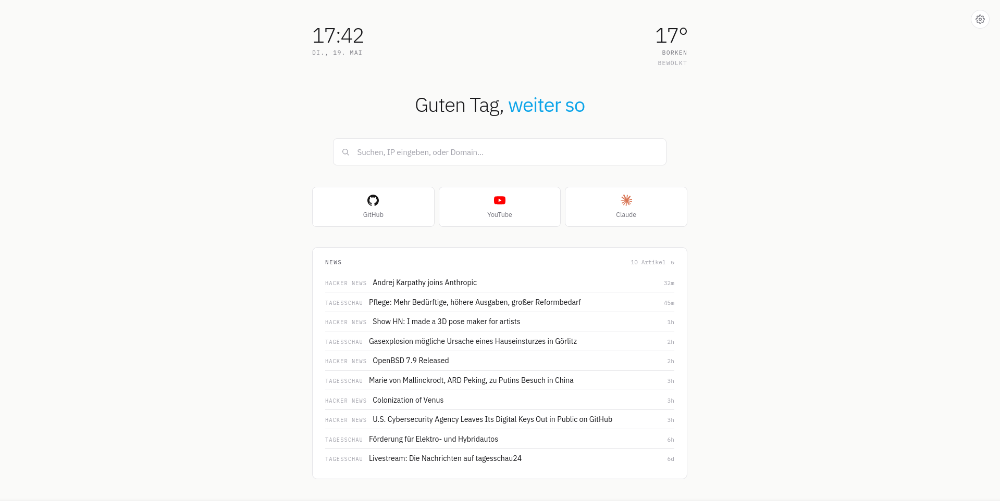
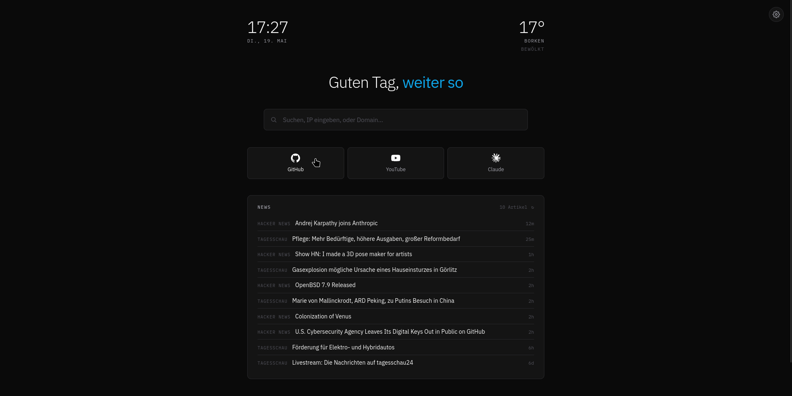
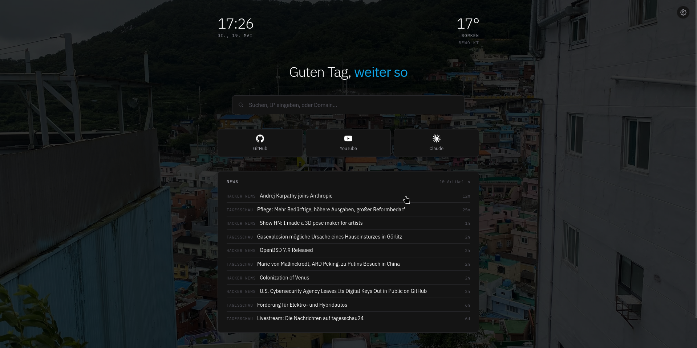

# Startpage

Minimalistische, anpassbare Browser-Startseite. Eine einzige HTML-Datei — kein Build, keine Abhängigkeiten, alle Einstellungen im `localStorage`.

**🌐 Demo: <https://tinybrickboy.github.io/startpage>** *(URL hier eintragen)*

## Features

- **Uhr & Datum** — minimalistisch, mit Wochentag
- **Wetter** — via Open-Meteo, Standort per Stadt **oder PLZ** (DE/AT/CH/NL/FR/US/GB)
- **Begrüßung** — tageszeit-abhängig (inkl. Schimpf-Modus von 3–5 Uhr morgens)
- **Smart Search** — erkennt IPs und Domains automatisch und schickt sie an konfigurierbare Tools (`ipinfo.io/{input}`, `digga.dev/?domain={input}`, …)
- **Bookmarks** — mit echten Marken-Icons via [Simple Icons](https://simpleicons.org)
- **News-Feeds** — RSS/Atom (Default: Tagesschau + Hacker News), beliebig erweiterbar
- **Notizen / Todos** — schnelle Listen, persistent
- **Themes** — Hell / Dunkel / Auto + freie Akzentfarbe
- **Hintergründe** — Farbe, Gradient oder eigenes Bild mit Verdunklung
- **Import / Export** — alle Einstellungen als JSON
- **Module ein-/ausblenden** — jede Sektion einzeln abschaltbar

## Screenshots

## Installation

Als Startseite setzen:

- **Firefox:** Einstellungen → Startseite → Benutzerdefinierte URL → URL einfügen
- **Chrome:** Einstellungen → Beim Start → Bestimmte Seite öffnen → URL einfügen

## Konfiguration

Alles über das Zahnrad-Icon oben rechts. Einstellungen werden im `localStorage` gespeichert und überleben Browser-Neustarts.

## Datenquellen

- Wetter: [Open-Meteo](https://open-meteo.com)
- Stadt-Lookup: [Open-Meteo Geocoding](https://open-meteo.com/en/docs/geocoding-api)
- PLZ-Lookup: [Zippopotam.us](https://zippopotam.us)
- Brand-Icons: [Simple Icons](https://simpleicons.org)
- Schrift: [IBM Plex](https://fonts.google.com/?query=ibm+plex)
