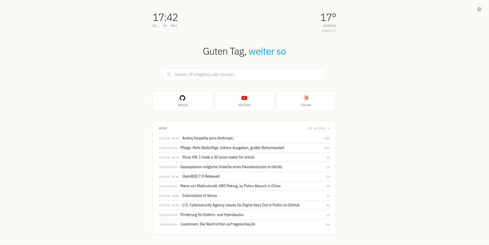
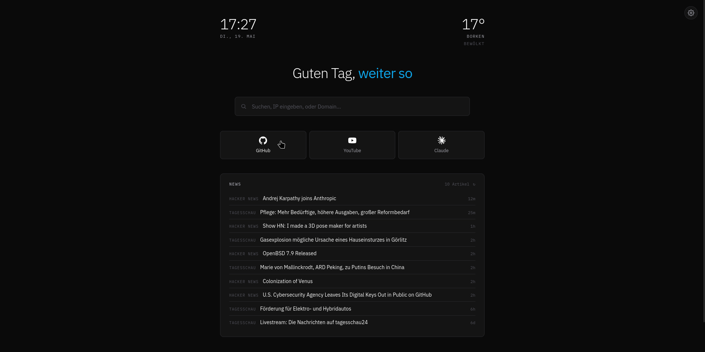
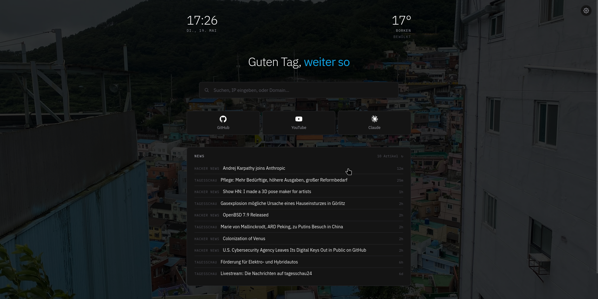

# Startpage

Minimal, customizable browser start page. A single HTML file: no build step, no dependencies, all settings stored in `localStorage`.

**🌐 Demo: <https://tinybrickboy.github.io/startpage>**

## Features

- **Clock & date**: minimal, with weekday
- **Weather**: via Open-Meteo, location by city **or postal code** (DE/AT/CH/NL/FR/US/GB)
- **Greeting**: depends on the time of day (including a scolding mode from 3 to 5 a.m.)
- **Smart search**: detects IPs and domains automatically and sends them to configurable tools (`ipinfo.io/{input}`, `digga.dev/?domain={input}`, …)
- **Bookmarks**: with real brand icons via [Simple Icons](https://simpleicons.org)
- **News feeds**: RSS/Atom (default: Tagesschau + Hacker News), freely extendable, optionally through your **own CORS proxy**
- **Notes / todos**: quick lists, persistent
- **Themes**: light / dark / auto plus a custom accent color
- **Backgrounds**: color, gradient or your own image with dimming
- **Import / export**: all settings as JSON
- **Show / hide modules**: every section can be turned off individually

## Screenshots

## Installation

Set it as your home page:

- **Firefox:** Settings → Home → Homepage and new windows → Custom URLs → paste the URL
- **Chrome:** Settings → On startup → Open a specific page → paste the URL

### Use it in every new tab (Firefox)

Firefox cannot open a custom URL in new tabs by itself. The add-on
[**Custom New Tab URL**](https://github.com/TinyBrickBoy/firefox-addon-custom-newtab)
adds that option. It also keeps the address bar empty, so you can still search
from it, and puts the cursor into the page.

## Configuration

Everything is behind the gear icon in the top right. Settings are stored in `localStorage` and survive browser restarts.

## Data sources

- Weather: [Open-Meteo](https://open-meteo.com)
- City lookup: [Open-Meteo Geocoding](https://open-meteo.com/en/docs/geocoding-api)
- Postal code lookup: [Zippopotam.us](https://zippopotam.us)
- Feeds (CORS proxy): [corsfix](https://corsfix.com) or your own proxy (Settings → Content). `{url}` is replaced by the encoded feed URL, `{rawurl}` by the unencoded one; without a placeholder the encoded URL is appended.
- Brand icons: [Simple Icons](https://simpleicons.org)
- Font: [IBM Plex](https://fonts.google.com/?query=ibm+plex)
